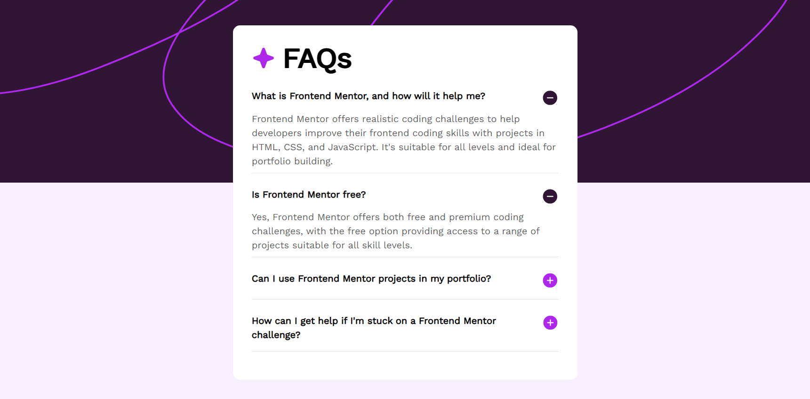

# Frontend Mentor - FAQ accordion solution

This is a solution to the [FAQ accordion challenge on Frontend Mentor](https://www.frontendmentor.io/challenges/faq-accordion-wyfFdeBwBz). Frontend Mentor challenges help you improve your coding skills by building realistic projects. 

## Table of contents

- [Overview](#overview)
  - [Screenshot](#screenshot)
  - [Links](#links)
- [My process](#my-process)
  - [Built with](#built-with)
  - [What I learned](#what-i-learned)
- [Author](#author)

## Overview

### Screenshot

### Links

- Challenge URL:  [Recipe page challenge on Frontend Mentor](https://www.frontendmentor.io/challenges/faq-accordion-wyfFdeBwBz)
- Live Site URL: [Live URL](https://fg-abc.github.io/FEM-FAQAccordion/)

## My process
I built this project with React and Tailwind CSS.

### Built with

- HTML5
- CSS
- Flexbox
- Tailwind CSS
- React
- Vite

### What I learned

During the making of this project, I've practiced various skills in HTML and CSS, and React.

In CSS,
- Background image
- Text shadow
- 

In React,
- UseState hook
- Props
- Creating an Accordion component

## Author

- Frontend Mentor - [@FG-ABC](https://www.frontendmentor.io/profile/FG-ABC)

